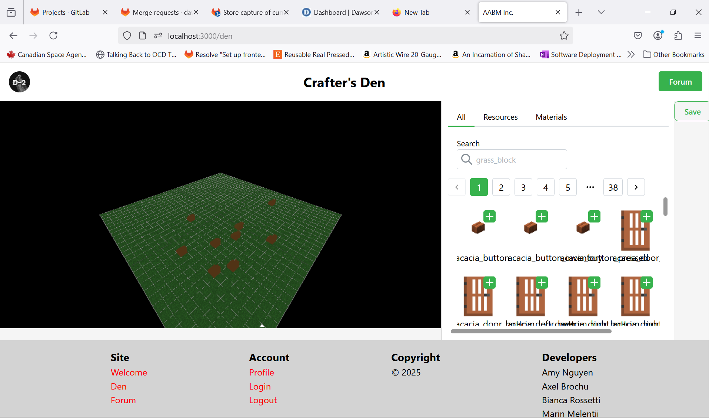
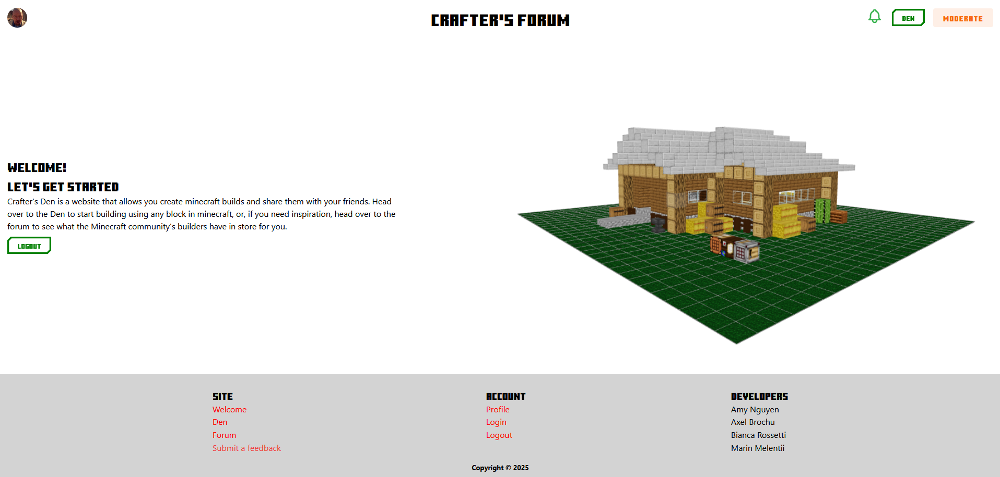
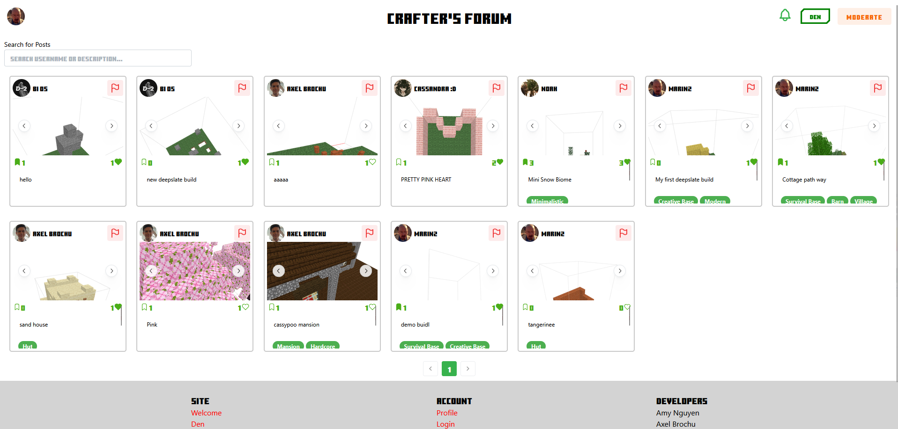
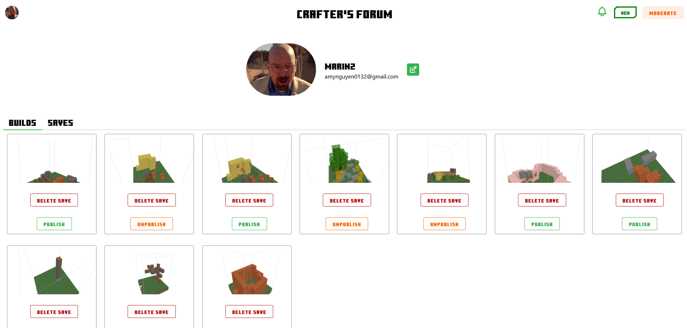

# Crafter's Den

This app will let users unleash their minecraft creativity by building anything they want in the 3d plane we provide them. They can select any blocks they want from the side panel and build on the 3d plane, and when done, they can either save their builds for later, or publish them to the forum! On the forum, users are able to look at all the builds that have been published, and will be able to search through them to filter them by their descriptions!






## Production Deployment
[Production Deployment URL](https://crafters-den-heenbqe7fcejcdfd.canadacentral-01.azurewebsites.net/)

### Why containers?
We containerized our app to make our app as platform agnostic as possible. It now only relies on a few environment variables. The container image is pushed to the gitlab container registry for deployment when tags are added to staging or main. It is then deployed as part of the pipeline. The app consists of a single container running the server. This allows us to easily change cloud providers as our needs change or go into self hosting. We also have the option of containerizing our database by adding a simple compose file if Atlas no longer meets our needs.

### Why azure?
Azure was chosen for its extensive documentation. The existence of a student subscription also played a big role in our decision. We still wanted to keep some flexibility so we moved to containers to allow for an easy migration if it is ever needed.

### Environment Variables
```
# DB
ATLAS_URI

# BLOB
AZURE_SAS
AZURE_BLOB_CONTAINER
AZURE_STORAGE_ACCOUNT

# AUTH
GOOGLE_CLIENT_ID
GOOGLE_CLIENT_SECRET
SECRET
```

## Development Deployment
[Development Deployment URL](https://crafters-den-dev-heenbqe7fcejcdfd.canadacentral-01.azurewebsites.net/)

### Why containers?
Using containers allows us to ensure that both our production and development deployments end up the same. This is important to account for any differences in machine configuration which could cause issues that would be hard to diagnose before a production deployment.

### Why azure?
Azure was chosen for its extensive documentation. The existence of a student subscription also played a big role in our decision. We still wanted to keep some flexibility so we moved to containers to allow for an easy migration if it is ever needed. Since this is just a development deployment we might look into very low cost hosting options since we dont expect heavy load.

### Environment Variables
Note that we chose to use a different mongo cluster and azure blob in case a bug was to damage some of the data in our database.
We want to keep both deployments as isolated as possible. However we chose to keep the google auth credentials the same as we only read from it so it poses no risk of accidental destruction.
```
# DB
ATLAS_URI

# BLOB
AZURE_SAS
AZURE_BLOB_CONTAINER
AZURE_STORAGE_ACCOUNT

# AUTH
GOOGLE_CLIENT_ID
GOOGLE_CLIENT_SECRET
SECRET
```


## Authors: Amy Nguyen, Axel Brochu, Bianca Rossetti, Marin Melentii

There are two directories in the __root__ of the project.

* The Express server is in `server/`
* The React app is in `directory/`
* The server responsd to API calls and serves the __built__ React app.

There are 3 package.json files -- see what `scripts` they define.

## Simple tech stack
Full stack MERN app with Mocha-Chai testing frameworks. Threejs used for the building plane, along with Mantine component library for all components used.

## Setup

To install all the dependencies and build the React app run:

```
npm run build
```

## Client side .env file:
```
AZURE_SAS='?sv=...'
ATLAS_URI="mongodb+srv://..."
AZURE_BLOB_CONTAINER="blobname"
AZURE_STORAGE_ACCOUNT="blob"

```

## Server side .env file
```
AZURE_SAS='?sv=...'
ATLAS_URI="mongodb+srv://..."
AZURE_BLOB_CONTAINER="blobname"
AZURE_STORAGE_ACCOUNT="blob"

# Auth
GOOGLE_CLIENT_ID='...'
GOOGLE_CLIENT_SECRET='...'
SECRET='...'
```

## Important requirements
To begin development, create a .env file in both the root repository and the server directory.
Format it as follows:
```
AZURE_SAS='?sv=azureurl'
ATLAS_URI="mongodb+srv://mydburl"
AZURE_BLOB_CONTAINER="blobcontainername"
AZURE_STORAGE_ACCOUNT="blobname"
```
Once this is done, your app is ready for development! 

## Deployment
To ensure your app deploys, you must set up the following CI/CD variables in gitlab. 

*This app deployment assumes you are deploying to an Azure container, and your authentication is done through Google.* 
*Please adapt to your needs*

__APP_NAME__ \
*App Service* \
Masked Expanded
	
*****
__ATLAS_URI__ \
*Mongo Atlas URI* \
Masked
	
*****
__AZURE_BLOB_CONTAINER__ \
*Blob container name* \
(Masked Expanded)
	
*****
__AZURE_SAS__ \
*Azure sign in link* \
(Masked)
	
*****
__AZURE_STORAGE_ACCOUNT__ \
*Blob storage account name* \
(Masked Expanded)
	
*****
__AZ_SP_ID__ \
*Azure app id* \
(Masked Expanded)
	
*****
__AZ_SP_SECRET__ \
*Azure password* \
(Masked Expanded)
	
*****
__AZ_TENANT__ \
*Azure value tenant* \
(Masked Expanded)
	
*****
__GOOGLE_CLIENT_ID__ \
(Masked Expanded)
	
*****
__GOOGLE_CLIENT_SECRET__ \
(Masked Expanded)
	
*****
__RESOURCE_GROUP_NAME__ \
Resource group \
(Masked)
	
*****
__SECRET__ \
(Masked)
	
*****
__WEBSITE_RUN_FROM_PACKAGE__ \
(Expanded) 

****

Once these variables are added, your app will be ready for deployment!

## To run the app

### Just the client

If `directory/package.json` has a `proxy` line, remove it. 

```
cd directory
npm run dev
```

### Just the server

If `directory/package.json` has a `proxy` line, remove it. 

```
cd server
nodemon api.mjs
```

### Client and Server

In the `directory/vite.config.js`, add a `server` property to the defineConfig:
```
export default defineConfig({
  plugins: [react()],
  server: {
      proxy: {
        '/api': {
          target: 'http://localhost:3000',
          changeOrigin: true
        },
      },
    },
});
```

This makes sure that when you make a fetch to any route beginning with `/api/some-resource`, it will proxy it to `http://localhost:3000/api/some-resource` for you.

Next, open 2 terminals. 

In one terminal (for the client):
```
cd directory
npm run dev
```

In another terminal (for the server):
```
cd server
nodemon api.mjs
```

## Tests
To run the tests:
```
cd server
npm run test
```