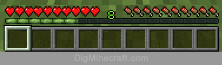
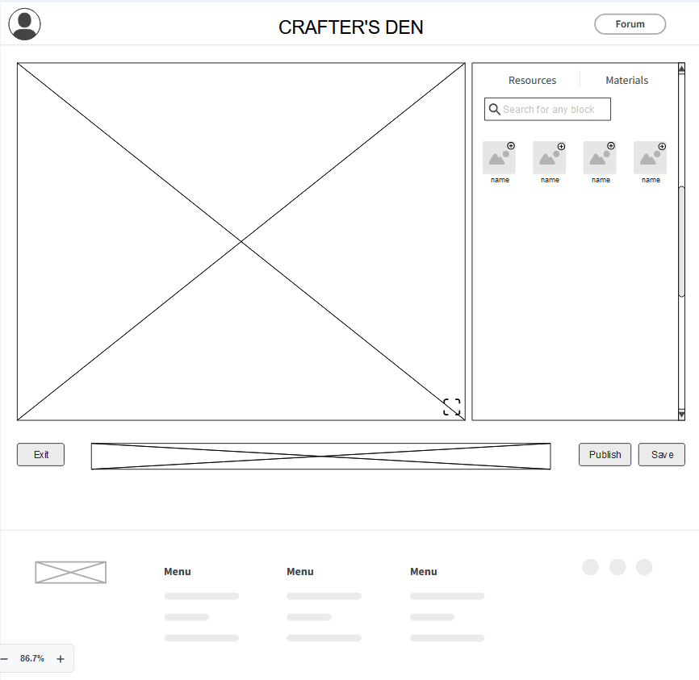
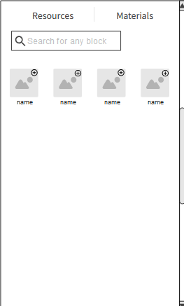
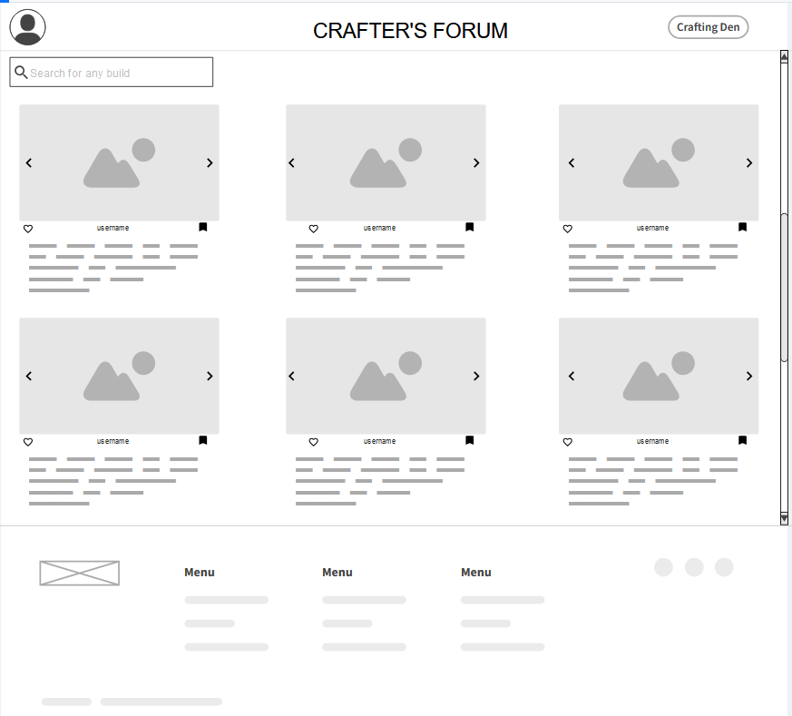
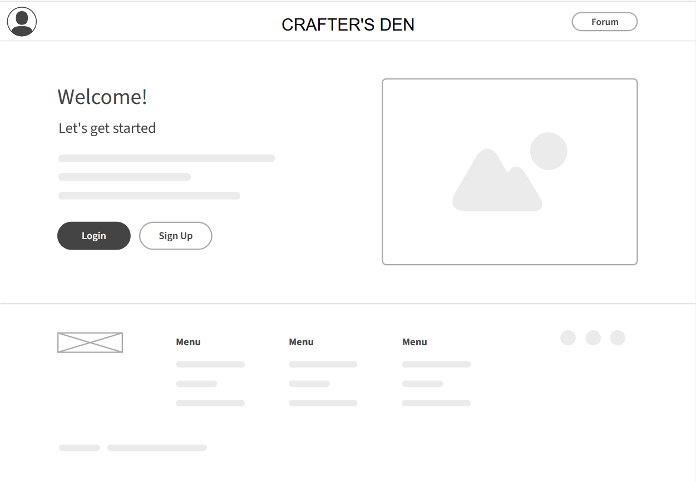
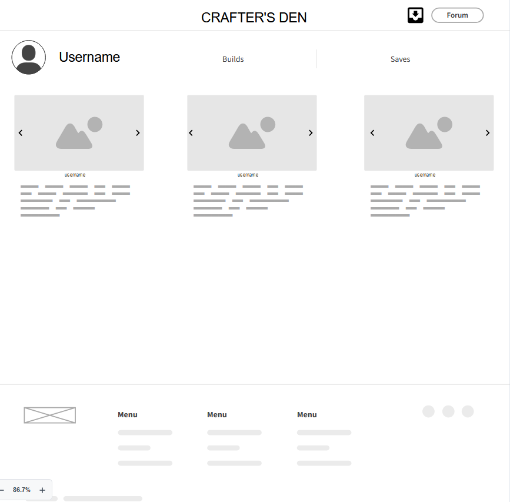

# Crafter's Den Project Proposal 

## Identification 

### Student Participant Names:
1. Amy Nguyen
2. Axel Brochu
3. Bianca Rossetti
4. Marin Melentii

### Name of team's software company: AABM Inc.

### Official project name (can be changed later): Crafter's Den 

### Project internal codename: Cube

## Project Summary 
Our project's main goal is to provide end users a way to freely build using a 3D plane in which they can add and remove given blocks on. On the side of the plane window, the page will offer a materials list that will contain the available blocks to use. In addition to the building aspect of the project, users will also have a forum/feed which allows them to share their builds as well as save other's. Each build will allow users to have access to a blueprint that will provide the layout and materials used to faciliate their Minecraft building experience.

#### Data sets 
We will be using a JSON file with all of the Minecraft blocks as well as their in-game names. We will also have the textures in an assets folder and link the block with the corresponding textures so that we can render it.

#### Uniqueness 
So far, we have yet to find a web application that provides what our project will offer. There exists sites that give users a way to find others in the community, as well as another that is just a general wikipedia type website. As Minecraft players ourselves, we find that if this project ends up to be a success, then it will also be something that we look forward to using.

#### Main audience/customers
We aim to appeal to customers like us (gamers, specifically Minecraft). This project is not intended for a specific age group, but for everyone who enjoys the game and are looking for another way to faciliate one aspect of the game, and make their overall experience even more enjoyable than it already is.

## User Personas 

### Persona Description: **Builders**

Name: Bob 

Importance of users corresponding to this persona: Important, they produce the content! 40-60% 

Broad goal: To create new building ideas.

#### User stories:
- As a builder, I want to see all possible blocks I can use for my build idea..
> A materials list next to building plane window with a search box for users to find their desired block, and hopefully a filter by block type (wood, stone...)

- As a builder, I want to be able to change views while I build
> The building plane window will allow users to hold CTRL and drag their mouse. This will cause the plane to be move according to where they wish to view from.

- As a builder, I want to be able to quickly build by a drag of a mouse AKA drag and place blocks.
> Users can hold and drag along their plane to quickly plane a line of blocks according to where their mouse is.

- As a builder, I want to be able to remove a block 
> The ability to right click on a block or drag their mouse with right click, removes a block.

- As a builder, I want to be able to change materials exactly like how Minecraft behaves (number keys, scroll mouse..)
> The ability to use number keys or mouse scroll wheel to navigate the build bar, like in Minecraft

- As a builder, I want to publish my builds..
> Users will be able to publish their builds onto the Crafter's Den forum, which other users can see. It can be liked and/or saved!

- As a builder, I want to take pictures of my build to use as my post's thumbnail
> The builder will have access to a feature that lets them take up to 4 pictures of their creation at any desired angle.

### Persona Description: **Browsers**

Name: Greg 

Importance of users corresponding to this persona: Equally as important, 90% or more, if not all.

Broad goal: To explore new build potentials and ideas, and see what the community is coming up with.

#### User stories:
- As a browser, I want to be able to like people's builds
> Users will be able to like a build by pressing the thumbs up on a build they like. 

> The creator will be able to see this and hopefully feel joy, via their inbox/notifications tab.s

- As a browser, I wish to explore the available builds to spark my creativity. 
> A forum with random builds for them to see. 

> A search bar to search and filter to more specific builds.

> A drop down that allows users to select certain materials. This would show builds that only contains that material, and perhaps a little more..

- As a browser, I wish to save builds I see on the forum page.
> Crafter's Den browsers will be able to save a bulid and view it later using the save button that will be shown with every build.
> The creator of the build will get a notification saying their build was saved by "username".

### Persona Description: **Moderators**

Name: Bobby

Importance of users corresponding to this persona: Moderately Important, They make sure the forum doesn't get filled with inappropriate things, <1% of users

Broad goal: To make sure the platform stays clean

#### User Stories:
- As a moderator I want to be able to see all reported builds.
> Builds reported by users will be shown in a notification window only visible to moderators.

- As a moderator I want to be able to remove builds.
> Moderators will have a button to remove a build that will only be available to them.
> The creator of this build will receive a notification in their inbox their build "title.." was removed by a moderator.

- As a moderator, i want to be able to ban creators.
> When removing a reported build, a moderator will receive a message saying how many times the user has been reported/builds removed. With this info, the moderator can chose whether or not to ban this user.

### Persona Description: **Copier**

Name: Josh

Importance of users corresponding to this persona: Very Important, They might need accommodations for how to view the builds, 70% of users

Broad goal: To replicate a build they've found in Minecraft

#### User Stories:
- As a copier I want to be able to see a list of all materials I will need.
> While viewing a build it will be possible to show a list of all materials used.

- As a copier I want to be able to rotate the build around so I can build from different angles.
> While viewing a build it will be possible to drag to see the build from any angle.

- As a copier I want to be able to hide different layers of the build so I can easily see what each of them look like individually.
> While viewing a build there will be a panel that lets you choose which layers are visible/hidden.

## Mockups 

## Main UI - The Crafting Den itself

### List of features presented
1. Window building plane 
2. Materials list
3. Items inventory bar
4. Navigation buttons 
5. Publish/save buttons for build 

## Main UI - Side panel

### List of features presented
1. Search feature for block searching
2. Resources used for build
3. Blocks displayed for selecting for build
4. Add block to hotbar

## The Forum 

### List of features presented 
1. Navigation button to go to den or profile
2. The search for build searching (done by description filtering..)
3. The builds displayed in cards format, with the options to like and/or save. Can also scroll through images to view the build in deeper.

## Inbox, Nofitications
To be implemented...

### List of features presented
1. Messages about others liking and/or saving the creator's build
2. Messages about own build getting deleted by a moderator (warning message, red)

## Welcome page

### Features presented 
1. Navigation button to go to profile or forum. The profile button on will lead the user to the login/sign up page.
2. General information displayed about site.

## User Profile Page 

### List of features presented
1. Navigations to forum, inbox..
2. Creator's (self) build displayed
3. View all saved builds.

